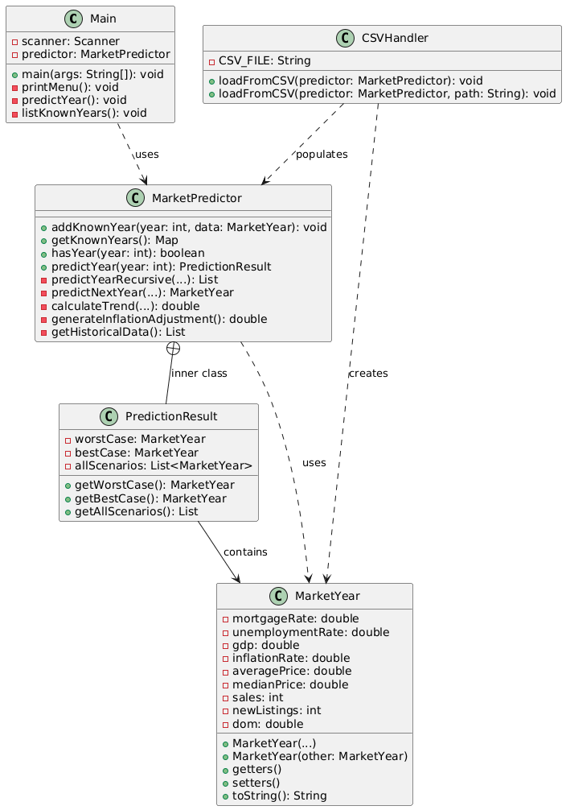

### Computer Science Culminating

# Housing Market Crisis

#### Authors: Erik Petrosyan, Ruan Viesti Moraes

## Problem

Toronto is facing a housing affordability crisis. Rising prices, high mortgage rates, and economic uncertainty make it hard for buyers and investors to plan. Without reliable predictions, people struggle to:

-   Decide when to buy or sell
-   Understand future market conditions
-   Plan financially for homeownership
-   Assess risk and opportunity

Current tools often lack:

-   Integration of multiple economic indicators (mortgage rates, unemployment, GDP, inflation)
-   Worst/best case scenario analysis
-   Recursive prediction that accounts for missing intermediate years
-   Clear visualization of price distributions and market uncertainty

## UML Diagram

